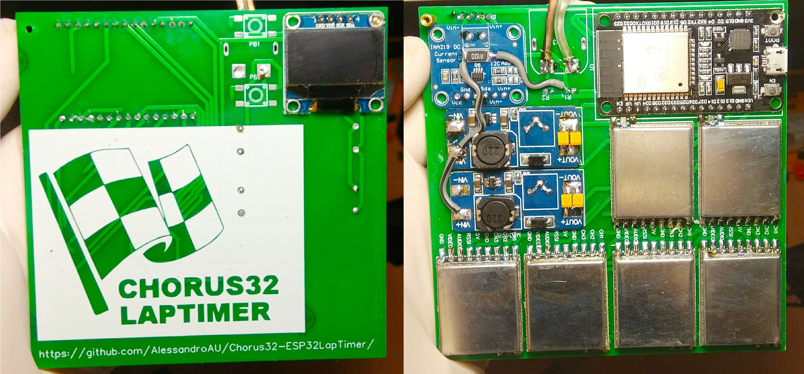
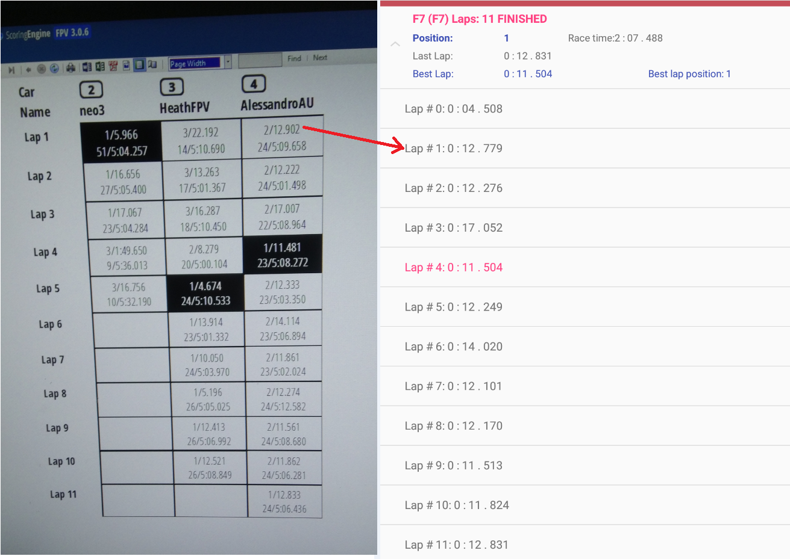
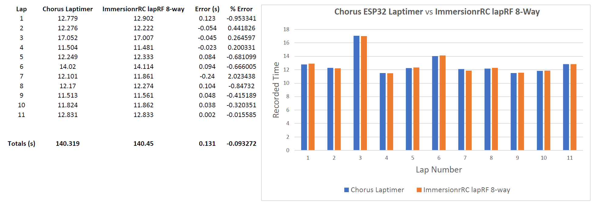

# Chorus32-ESP32Laptimer

Based on the popular Chorus RF Laptimer, this ESP32 port provides many significant advantages. Not only does the ESP32 provide much more processing power than AVR based Arduino boards, but it also has built in Wifi and Bluetooth networking, which greatly improve connectivity options.

Compared to the original ChorusRF Lamptimer this ESP32 version only requires one RX module per pilot and a single ESP32 (nodemcu or similar) board. This allows you to connect your Lap timer wirelessly with no extra hardware required.

Hardware construction is also simplified as both parts are 3.3v logic and there is no need for level shifting or resistors.  

[Click HERE for a video showing the full setup process to get Chorus32 running on your ESP32 using Arduino IDE.](https://www.youtube.com/watch?v=ip2HUVk_lMs). 

Updates:
-----
*Important Notice for Chorus32 users!!!:*

As of last commit the default pinout has been changed to match that of the PCBs currently being tested.

For anyone that has built a Chorus32 with original schematics do not worry, your unit will continue working with future updates. However you must comment out '#define Default_Pins " and un-comnent '//#define Old_Default_Pins' in 'HardwareConfig.h' when compiling.

Added OLED and VBAT measurement support
Auto RSSI threshold setup is also not implemented, just set thresholds manually for now.

Added inital webserver configuration portal
https://www.youtube.com/watch?v=BVd2t0yO_5A/0.jpg

Application Support:
-----
Chorus32 communicates using the Chorus RF Laptimer API, which is supported by LiveTime.

LiveTime is an incredibly powerful and feature-rich timing system which runs on Windows. It is, however, quite complex, and likely overkill for most users. 

More information can be found here: https://www.livetimescoring.com/ 

If you are looking for a simpler setup, you can also use the Chorus RF Lap Timer app available for:

Android: https://play.google.com/store/apps/details?id=app.andrey_voroshkov.chorus_laptimer

iOS: https://itunes.apple.com/us/app/chorus-rf-laptimer/id1296647206?mt=8

Hardware:
-----
Construction is easy and only requires some basic point to point wiring of each module to the ESP32 board.

See HardwareConfig.h for pin assignments, it is possible to change any pin assignments apart from ADC channels. Note that pin assignments are GPIO hardware pin numbers and not pin numbers specific to the particular ESP32 development board you may be using. 

PCB designs are currently being tested

Performance:
-----
The Chorus32 Lap timer was compared to the $600USD ImmersionRC LapRF 8-Way at a local indoor event, arguably the worst conditions due to multipath and reflections. Results are presented below, you can see that the Chorus32 very closely matches the measured lap times of the LapRF.

Compiling the Project:
-----
~~Due to the fact that both the Bluetooth and Wifi stack are used quite alot of program memory is required. To compile the project you must choose 'Partition Scheme' -> Minimal SPIFFS in the Arduino IDE. Board should be selected as 'ESP32 Dev Module' in most cases.~~

As we are not supoorting bluetooth for now and are using the SPIFFS partition leave the Partition Scheme as 'default'

Library requirements:
-----
Adafruit_INA219 https://github.com/adafruit/Adafruit_INA219

ESP8266 AND ESP32 OLED DRIVER FOR SSD1306 DISPLAY https://github.com/ThingPulse/esp8266-oled-ssd1306
